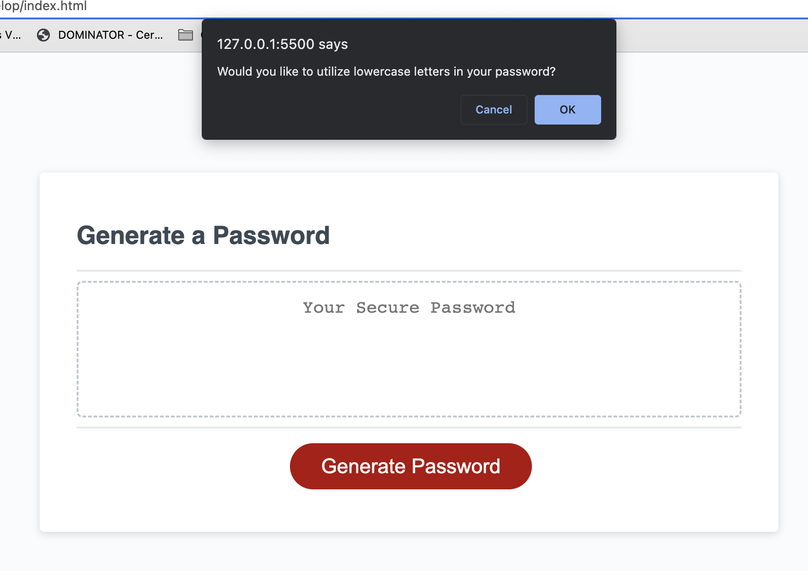

 Password Generator
## Description

This assignment was to showcase how to use the stater code which I didn't maniplulate because it already shows the box and buttont to generate password.
For this task, the goal is for the user to click on the generate password button, go through a series of questions / prompts coded by the coder and then output a random password for the user!

## Usage

For this task, JS or Javascript file was specifically utlized and manipulated. I had to first declare variabes and characters to make sure random characters, strings, and numbers populated when running in the backround. After this, I made characterLength variable set to prompt and parsed it to make sure the promp would show if the user inputted anything less than 8 characters or more that 128 characters. Form there, I created the prompts using if statements stating that if the user clicks ok, continue, and if cancel move on to the next section! Form there, after the user is done clicking on the prompts,  it will return true and then it will go into the if statment and generate a password after passing the for loop. The skills I used for this task was for loops, math random and math floor which was googled to randomize the numbers and making sure the characters were random as well. The goal was for a user to input a number between 8 or 128 as a password, ask the user a series of questions uppercase, lowercase, special characters, etc of what password type they wanted and after that, the code will output a random password for the user!

Website URL!!
https://salzm.github.io/Password-Generator/